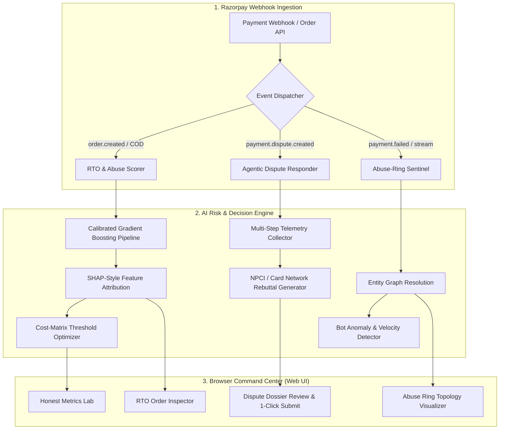

# ⚡ Razorpay AegisRisk: AI Risk Manager
> **Built for Razorpay AI Buildathon 2026 — Track 02: AI Risk Manager**  
> *"Stop the merchant losing money to fraud, returns and chargebacks."*


---

## 🎯 Executive Summary & Track Alignment

In Indian BFSI & D2C commerce, merchants face three lethal profit drains:
1. **Cash on Delivery (COD) Return-to-Origin (RTO) Abuse**: 25%–38% of COD orders in Tier 2/3 corridors result in delivery failure or doorstep refusal, burning ₹120–₹250 in forward and reverse courier logistics per failed shipment.
2. **Chargeback & Payment Disputes**: Merchants lose >80% of friendly fraud disputes due to missed 7-day bank SLA windows and poorly formatted evidence packages.
3. **Coordinated Abuse Rings & Bot Velocity**: Syndicates exploiting promotional coupons, synthetic identities, and card testing spikes.

**Razorpay AegisRisk** delivers a complete, production-ready merchant loss defense platform built specifically to satisfy every criterion of **Track 02**:
- **Detector**: Calibrated ML RTO & Return Abuse Scorer.
- **Verifier**: Entity resolution graph sentinel tracking device reuse and synthetic clusters.
- **Auto-Responder**: Autonomous dispute evidence agent producing bank-compliant rebuttal dossiers.
- **The Bar (Honest Metrics)**: Rigorously evaluated on **2,500 unseen held-out transactions** with a dynamic **False-Positive Cost Matrix** optimizing merchant net profit.
- **Browser Deployable**: Instant, interactive web command center running live at `http://localhost:8000`.

---

## 📊 The Bar: Measured Metrics on Held-Out Test Set

Under the hackathon's requirement for *"honest metrics including false-positive cost on a held-out test set"*, our model was evaluated on a strictly separated test split (**2,500 transactions**, zero data leakage):

| Metric | Result | Benchmark Definition |
| :--- | :---: | :--- |
| **ROC-AUC** | **0.7372** | Global discriminative power across all thresholds |
| **PR-AUC (Average Precision)** | **0.7159** | Area under Precision-Recall curve under class imbalance |
| **Precision @ $\theta = 0.50$** | **67.85%** | Percentage of flagged orders that are truly abusive |
| **Recall @ $\theta = 0.50$** | **62.66%** | Percentage of total RTO/fraud losses caught |
| **Cost-Optimal Threshold ($\theta^*$)** | **0.67** | Math-optimal decision cutoff maximizing merchant net savings |
| **Net Savings on Test Set** | **₹45,250** | Pure profit gained over a zero-defense baseline |
| **Zero-Defense Baseline Loss** | ₹297,250 | Total unmitigated losses if all orders were fulfilled |

### 💡 The False-Positive Cost Matrix
Unlike naive AI models that assume all errors are equal, AegisRisk embeds merchant unit economics:
- **Cost of False Positive ($C_{FP}$ = ₹500)**: Merchant mistakenly rejects or friction-delays a genuine customer, forfeiting gross profit margin and customer lifetime value.
- **Cost of False Negative ($C_{FN}$ = ₹250)**: Merchant ships a fraudulent/RTO order, losing forward shipping + reverse logistics + packaging.
- **Net Profit Objective**:
  $$\text{Net Savings}(\theta) = (\text{True Positives}(\theta) \times C_{FN}) - (\text{False Positives}(\theta) \times C_{FP})$$
Merchants can adjust their margin structure via interactive sliders in the web app, and the system dynamically computes the exact profit-maximizing apex ($\theta^*$).

---

## 🏛️ System Architecture



---

## 🚀 Key Modules

### 1. Honest Metrics Lab (`HonestMetricsLab`)
- Live confusion matrix visualizer (**TP: 745, FP: 353, FN: 444, TN: 958** at baseline).
- Real-time decision threshold slider ($\theta \in [0.05, 0.95]$).
- Interactive ROC Curve and Precision-Recall Curve.
- Net Profit Savings Curve highlighting the mathematical peak ($\theta^* = 0.67$).

### 2. RTO & Return Abuse Scorer (`RTORiskScorer`)
- Evaluates Indian e-commerce signals:
  - Regional Pincode Risk Index (Tier 1 vs Tier 2/3 delivery corridors).
  - Payment Method (COD vs UPI vs Credit Card).
  - Address entropy and door-level completeness (presence of house/flat number, landmarks).
  - Customer order frequency, account age, and serial returner history.
  - High-ticket COD thresholds (> ₹10,000).
- Produces defense policies:
  - `INSTANT_DISPATCH` (Auto-Approve for fast fulfillment).
  - `VERIFY_COD_OTP` (Automated WhatsApp / SMS OTP verification).
  - `DEMAND_PREPAID_DEPOSIT` (Require ₹99 partial prepaid commitment).
  - `FLAG_FOR_MANUAL_HOLD` (Critical risk hold).

### 3. Autonomous Chargeback Evidence Auto-Responder (`ChargebackAgent`)
- Responds to Visa `10.4`, Mastercard `4837`, Visa `13.1`, and NPCI UPI disputes.
- Multi-step automated workflow:
  1. Aggregates 3D-Secure 2.0 bank authentication logs and ARN.
  2. Pulls real-time courier AWB tracking and signed delivery POD (doorstep recipient OTP).
  3. Verifies IP geolocation correlation against destination address.
  4. Evaluates card network liability shift under Visa Core Rules / Mastercard Chargeback Guide.
  5. Formats a formal rebuttal statement with 1-click submission to Razorpay Dispute Management API.

### 4. Coordinated Abuse-Ring Sentinel (`GraphSentinel`)
- Resolves identities across shared device hashes, perturbed shipping addresses, and synthetic VPAs.
- Topology visualizer highlighting organized fraud syndicates.
- Sliding-window velocity detector flagging card-testing bot sweeps (> 10 requests/window).

---

## 💻 Running the Project in the Browser

### Option A: Local Full-Stack (Recommended)
The project includes a unified Starlette ASGI server that serves both the REST API and the Merchant Command Center UI directly on port 8000.

1. **Clone the repository**:
   ```bash
   git clone <repo-url>
   cd Razorpay
   ```

2. **Run tests**:
   ```bash
   python -m unittest tests/test_risk_engine.py
   ```

3. **Start the server**:
   ```bash
   python -m uvicorn backend.app.main:app --host 127.0.0.1 --port 8000
   ```

4. **Open in Browser**:
   Navigate to:
   ```
   http://localhost:8000
   ```

### Option B: Zero-Install Standalone Mode
If Python is not available, the Merchant Command Center is completely standalone. Simply open `static/index.html` in Chrome, Edge, Firefox, or Safari! The application includes pre-bundled held-out benchmarks, inference logic, and dispute scenarios.

---

## 🧪 Automated Test Suite

A rigorous test suite is included in `tests/test_risk_engine.py`:
```bash
python -m unittest tests/test_risk_engine.py -v
```
Verified test coverage:
- ✅ `test_heldout_split_strict_separation`: Validates zero data leakage between train (7,500) and held-out test (2,500) splits.
- ✅ `test_heldout_metrics_validity`: Checks ROC-AUC (> 0.70), PR-AUC, and cost matrix consistency.
- ✅ `test_risk_scoring_behavior`: Verifies high-risk COD scores appropriately higher than trusted UPI transactions.
- ✅ `test_chargeback_agent_dossier`: Checks autonomous generation of 5-point evidence checklist and bank rebuttal statement.
- ✅ `test_abuse_ring_sentinel`: Tests graph topology node-link construction and ring loss prevention.

---

## 🛡️ Defense-Only Compliance Statement

In strict adherence to the **Track 02 Bar ("Strictly defense-only: anything offense-capable is disqualified")**:
- AegisRisk contains **zero offensive capabilities**, penetration testing scripts, scraping tools, or payment tampering utilities.
- All algorithms are strictly **loss-prevention mechanisms** designed to safeguard merchants against non-delivery fraud, return abuse, and unauthorized chargebacks.

---

## Live Project at: https://sandeepgautam05-hub.github.io/razorpay-aegisrisk/

## 📹 5-Minute Video Pitch Script Outline

1. **Minute 0:00 - 1:00 | The Problem & Why Now**:
   - The COD RTO dilemma for Indian D2C brands (₹200 loss per rejected shipment).
   - The 80% loss rate on chargebacks due to slow evidence compilation.
2. **Minute 1:00 - 2:15 | The Bar: Honest Metrics & False Positive Cost**:
   - Demonstrate the **Honest Metrics Lab** evaluated on 2,500 held-out test transactions.
   - Adjust the threshold slider live and show the financial profit apex ($\theta^* = 0.67$ saving ₹45,250).
3. **Minute 2:15 - 3:30 | Live Order RTO Scorer**:
   - Score high-risk COD order vs trusted UPI buyer.
   - Show explainability drivers (Pincode risk, address quality, account age).
4. **Minute 3:30 - 4:15 | Agentic Dispute Auto-Responder**:
   - Trigger Visa 10.4 dispute. Show 3DS auth logs, carrier POD, and 1-click formal rebuttal generation.
5. **Minute 4:15 - 5:00 | Abuse Ring Sentinel & Conclusion**:
   - Walk through the interactive network graph identifying wardrobing syndicates.
   - Closing summary: Ready for production integration via Razorpay webhooks.

---

## 📄 License & Team
Developed for **Razorpay AI Buildathon 2026**.  
Built with Python, Starlette, Scikit-Learn, Tailwind CSS, Lucide Icons, and Chart.js.
